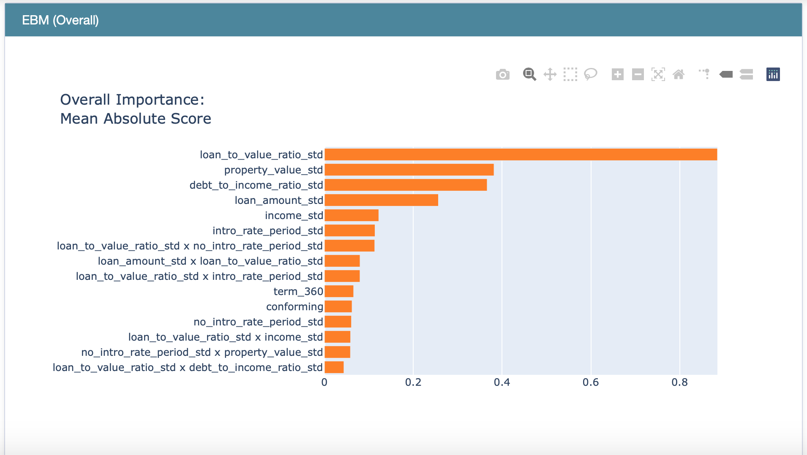
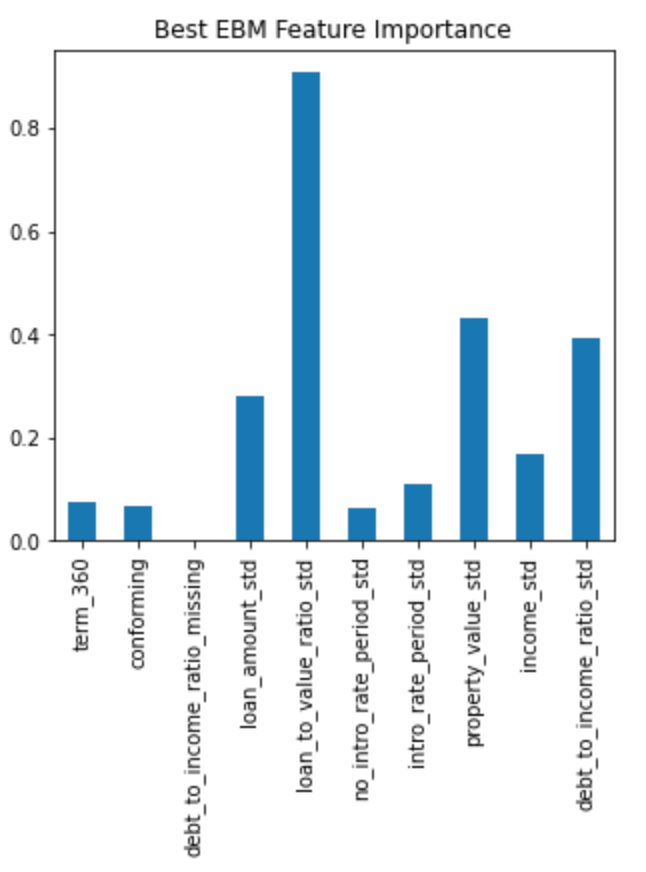
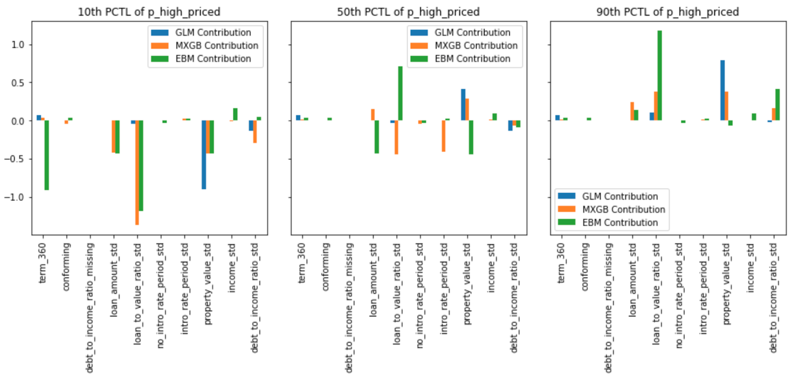
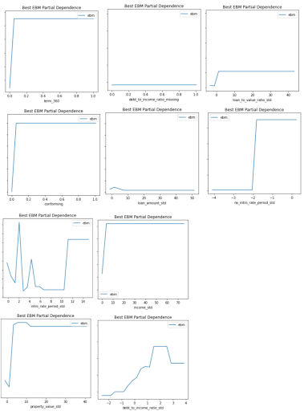
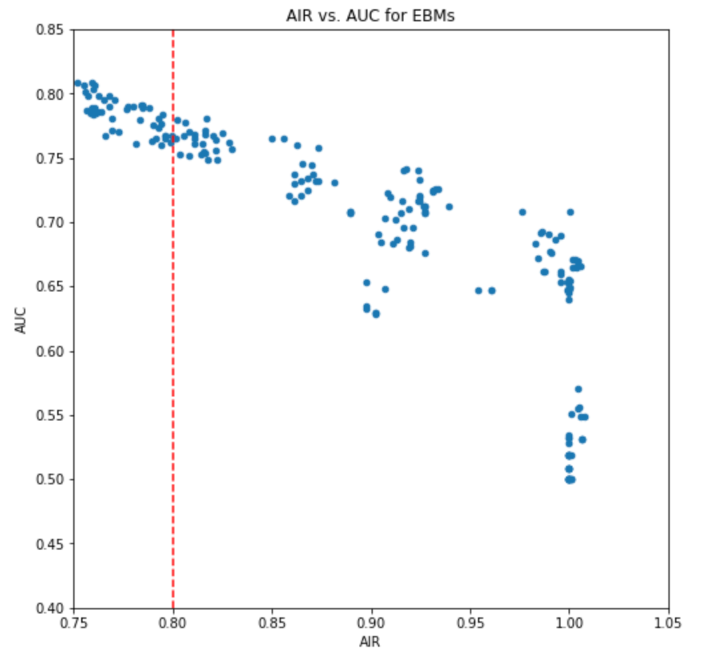
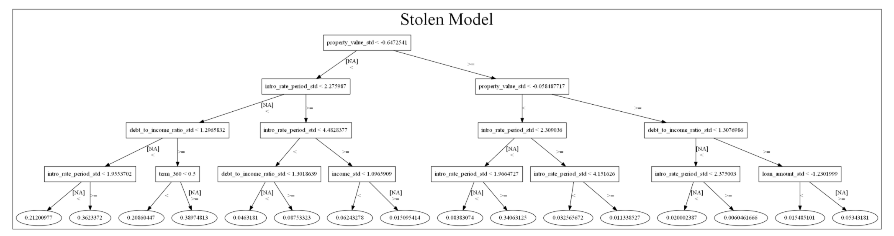
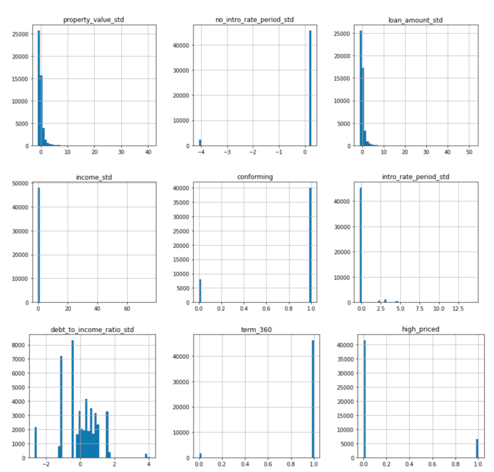
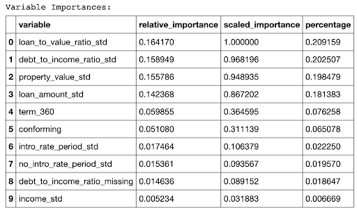

# Loan Lending Model #

Model developed by the George Washington University Summer Class 2021 
Responsible Machine Learning w/ Professor Patrick Hall

Last updated: June 2021

***
## Intended use
* **Business value of model:**  The purpose of our model is to decide whether to lend money or not to a person who has a higher priced mortgage rate. Our model takes into consideration adverse impacts due to racial differences. As a result, our model provides a more fair lending experience to applicants.

* **Model design:** Our group best model EBM designed to fit with random grid search, and then we need to avoid the discrimination problem when we find the best cutoff point for Black vs White AIR. Therefore, it is designed to lessen the discrimination problem. 

* **Intended use:**   The intended user for our group best remediated model would be student, professor, researchers and other data scientists who need a specific sample to make certain conclusions.  

* **Additional use of model:** This model can't be used in other situations as the model doesn't take unexpected global or social economical events into consideration.

***
## Training data

*  **Training data:** [Source of training data](https://github.com/jphall663/GWU_rml/blob/master/assignments/data/hmda_train_preprocessed.zip)

* **Dividing training dataset:** 70% is training part and 30% is validation part

* **Number of rows in training and validation part:** Training part has 111972 rows of data and validation part has 48366 rows of data

* **Meaning of all training data columns:**

  * conforming: Binary numeric input, whether the mortgage conforms to normal standards (1), or whether the loan is different (0), e.g., jumbo, HELOC, reverse mortgage, etc. 	

  * debt_to_income_ratio_std: Numeric input, standardized debt-to-income ratio for mortgage applicants.
 
  * debt_to_income_ratio_missing: Binary numeric input, missing marker (1) for debt to income ratio std.
  
  * income_std: Numeric input, standardized income for mortgage applicants.
  
  * loan_amount_std: Numeric input, standardized amount of the mortgage for applicants.

  * intro_rate_period_std: Numeric input, standardized introductory rate period for mortgage applicants.
 						
  * loan_to_value_ratio_std: Numeric input, ratio of the mortgage size to the value of the property for mortgage applicants.
 		
  * no_intro_rate_period_std: Binary numeric input, whether or not a mortgage does not include an introductory rate period.
 			
  * property value std: Numeric input, value of the mortgaged property.
 					
  * term 360: Binary numeric input, whether the mortgage is a standard 360 month mortgage (1) or a different type of mortgage (0). 
 						

***
## Evaluation data

*  **Evaluation data:** [Source of test data](https://github.com/jphall663/GWU_rml/blob/master/assignments/data/hmda_test_preprocessed.zip)

* **Number of rows in test dataset:** Test data contains 19831 rows and 22 columns

* **Differences in columns between training and test dataset:** Training dataset contains 1 more column ‘high_priced’ than the test dataset. ‘high_priced’ is the binary target variable in the training dataset

***
## Model details
*  **Input columns include:** ['property_value_std',
               'no_intro_rate_period_std',
               'loan_amount_std',
               'income_std',
               'conforming',
               'intro_rate_period_std',
               'debt_to_income_ratio_std',
               'term_360']
*  **Target columns:** ['high_priced']
*  **Model Type:** Explainable Boosting Machine
*  **Software Implemented:** Python Virtual Environment
*  **Modeling software versions:**  [View software and package versions](https://github.com/jphall663/GWU_rml/blob/master/assignments/requirements.txt)
*  **Parameter settings:** {'max_bins': 512,
              'max_interaction_bins': 16,
              'interactions': 10,
              'outer_bags': 4,
              'inner_bags': 0,
              'learning_rate': 0.001,
              'validation_size': 0.25,
              'min_samples_leaf': 5,
              'max_leaves': 5,
              'early_stopping_rounds': 100.0,
              'n_jobs': 4, 
              'random_state': 12345}

***

## Quantitative analysis
* **Metrics to evaluate model:** Our group decided to use AUC to evaluate our model. After we ran the stress testing, residual analysis, and removed the outliers, we found the best AUC to be 0.7953.

* **Values for training, validation and evaluation data:**
	* Training AUC: 0.7917
	* Validation AUC: 0.7953
	* Evaluation results submitted as group2: [EBM evaluation results](https://nbviewer.jupyter.org/github/jphall663/GWU_rml/blob/master/assignments/eval.ipynb)

	

* **Model Plots**
	
   **Assignment 1**
   
   *Variable Importance Plot*

	**Source:** [Assignment 1](https://github.com/MachingLearning-Group-2/Responsible-ML_Group_2/blob/main/Assignment%201%20_%20Group%202/A_01(code).ipynb)
	
   **Assignment 2**
   
   *Global Feature Importance Plot*
	

	**Source:** [Assignment 2](https://github.com/MachingLearning-Group-2/Responsible-ML_Group_2/blob/cfb1ed9c4e408b36aacca309351c40c1c15fa63b/Assignment%202/A_02.ipynb)

   *Local Feature Importance Plot*
   

	**Source:** [Assignment 2](https://github.com/MachingLearning-Group-2/Responsible-ML_Group_2/blob/cfb1ed9c4e408b36aacca309351c40c1c15fa63b/Assignment%202/A_02.ipynb)

   *Partial Dependence Plot*

	**Source:** [Assignment 2](https://github.com/MachingLearning-Group-2/Responsible-ML_Group_2/blob/cfb1ed9c4e408b36aacca309351c40c1c15fa63b/Assignment%202/A_02.ipynb)

   **Assignment 3**

   *Adverse Impact Ratio vs AUC for EBMs*

	**Source:** [Assignment 3](https://github.com/MachingLearning-Group-2/Responsible-ML_Group_2/blob/cca2edeed1580a4153da801f7e98d65585fe54f7/Assignment%203/Group_2_Responsible_ML_Assignment%203.ipynb)

   **Assignment 4**
   
   *Simulate blackbox attack*
	

	**Source:** [Assignment 4](https://github.com/MachingLearning-Group-2/Responsible-ML_Group_2/blob/cca2edeed1580a4153da801f7e98d65585fe54f7/Assignment%204/Group2_Responsible_ML_Assignment_4.ipynb)	

   **Assignment 5**
   
   *Stress Testing of Model*
   

	**Source:** [Assignment 5](https://github.com/MachingLearning-Group-2/Responsible-ML_Group_2/blob/cca2edeed1580a4153da801f7e98d65585fe54f7/Assignment%205/A_05.ipynb)

* **Alternative models considered:** The team considered Elastic Net and Monotonic XGBoosting Models; however, our remediated EBM model out performed both. 
	
   *Monotonic XGBoosting AUC: 0.7928*
   
   *Elastic Net Results*
	

	**Source:** [Assignment 1](https://github.com/MachingLearning-Group-2/Responsible-ML_Group_2/blob/9ea2817024d255e2f7a5d560544e1e2830c62b5a/Assignment%201%20_%20Group%202/A_01(code).ipynb)

***
## Ethical considerations
* **Potential negative impacts:**
  * Models are based on trained data with an adequate accuracy rate but will still incorrectly mark a high-priced loan for a proportion of the population.   
  * Although model was remediated to reduce bias, there is still the potential racial discrimination in the model where Black applicants may have more of a chance in receiving a high-priced loan compared to White applicants. 
* **Potential uncertainties:** 
  * Software and package versions could cause a problem in reproducing the same results.  Although the team has been using the same application versions and environments, we still came to subtle differences in results that were unexplainable. 
  * Due to the above uncertainty, models deployed on different machines may come to rare difference in determining applicants’ loan approval.  
* **Challenges during training:** The model performs poorly when there are noticeable outliers.  The model was unable to provide an accurate prediction of the high-priced loans.  Unexpected global recessions will also cause the accuracy of models to drop. 
	

